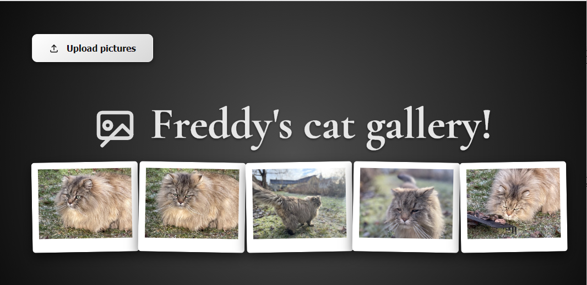
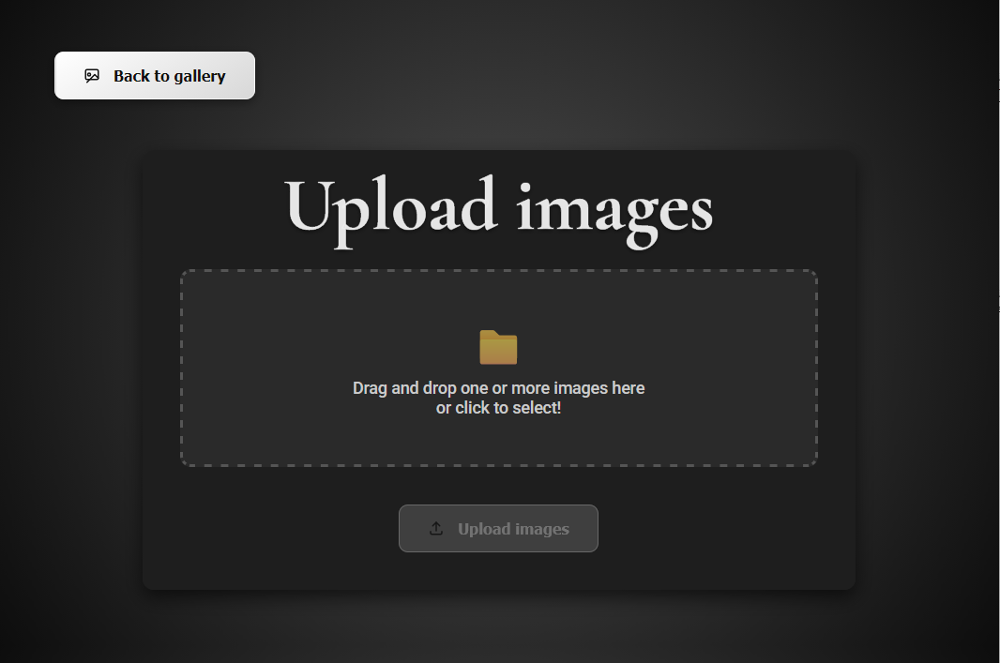
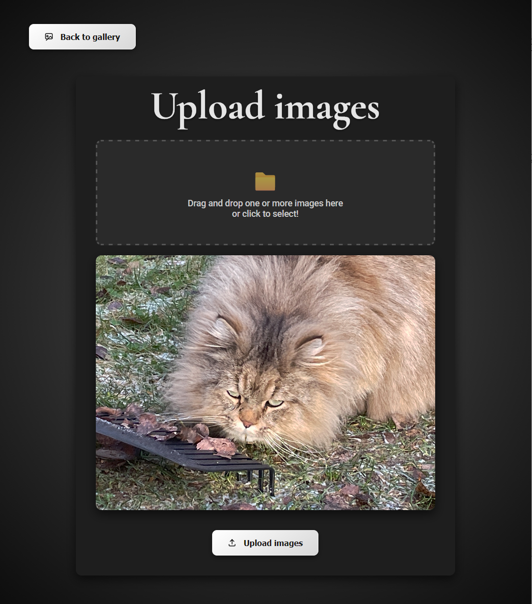
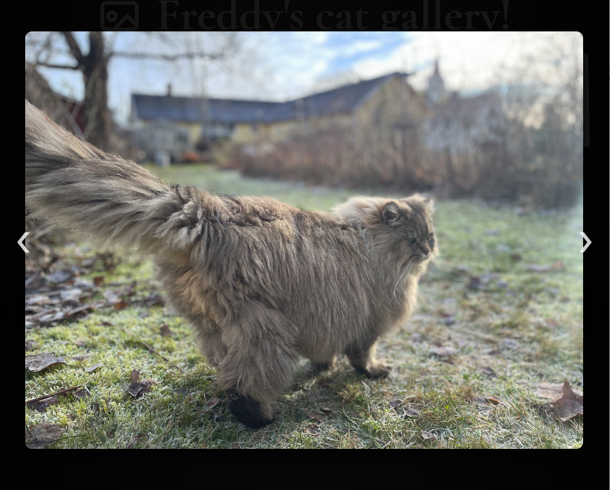

# Gallery with PHP upload. Thumbnail creation and responsive design.

## Features

* Uploading images to a folder and generating thumbnails.
* EXIF‑aware rotation handling so iPhone photos stop acting drunk.
* Pinch‑to‑zoom support for that “let me get a closer look” moment.
* Responsive design for tablets and phones.
* Keyboard navigation for old desktop farts like myself who still believe in arrow keys and the power of esc.
* Touch-support so it should work even if your kid has peanut butter on their fingers whilst swiping left right.
* No external dependencies.

## How it works

- /upload uploads the original to '/images' and creates a thumbnail in '/thumbnails'.
- index lists all images in the thumbnails-folder and shows the fullsize uploaded one.

## Notes
- IMPORTANT! You might have to create a folder "images" and "thumbnails" in root in order for it to work. You can't commit empty folders to Github so that's why they are missing.
- It was tested using Apache 2.4 PHP 8.5.
- If uploads aren't working, check the folder write permissions. If you’re using FileZilla, right‑click the folder and hit "Set permissions". Otherwise, ask someone with a suspiciously pale bearded one or someone who still carries a calculator like it’s 1993. They'll know what to do. They have what's known as a "UNIX-beard" and the knowledge it carries is grand.

## Screenshots

### License means you can use it as you please, and don't bother me unless you're buying a beer. Fork it, make a new version. Improve upon it. It's fully free to use however you want. 

